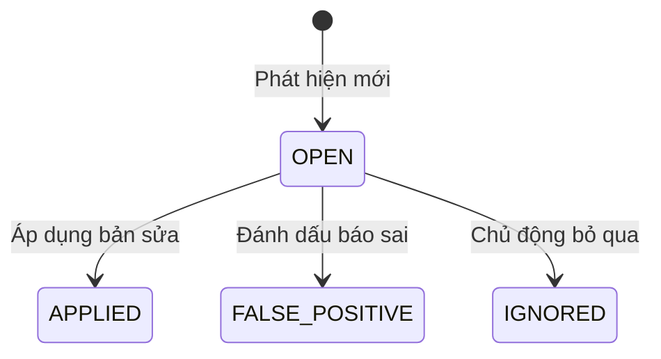

## 3.4. Thiết kế chi tiết Backend và API

Phần này mô tả các thành phần chạy phía sau giao diện: CLI, REST API server, cơ chế giao tiếp với Python, hệ thống AI provider, và vòng đời của finding trong hệ thống.

### 3.4.1. Tầng CLI và REST API (Node.js)

Tầng Node.js đóng vai trò là điểm vào duy nhất của hệ thống. Nó cung cấp cả CLI và REST API server, đồng thời là cầu nối với Python engine.

**CLI entry point** (`bin/cli.js`) xử lý ba command chính. Lệnh `scan` nhận tham số `--target`, `--mock-ai`, `--mock-scan`, `--fast` và spawn Python process rồi đọc kết quả từ stdout/file. Lệnh `serve` khởi động Express server trên port do người dùng chỉ định. Lệnh `ui` kết hợp serve và tự động mở trình duyệt.

**Express server** (`src/server.js`) là tầng trung gian duy nhất giữa frontend và engine. Server mount tất cả REST routes, phục vụ static files từ thư mục public (web dashboard đã build), và xử lý CORS. Cấu trúc routes được tổ chức theo resource: config route đọc/ghi cấu hình AI, scan route xử lý lệnh scan và SSE stream, reports route trả về danh sách và nội dung report, apply route thực hiện ghi đề xuất sửa lỗi vào file kèm backup, chat route giao tiếp với AI provider, file route đọc nội dung file gốc, backup route quản lý backup và restore.

**Python bridge** (`src/bridge.js`) là cầu nối giữa Node.js và Python. Bridge dùng `child_process.spawn` để chạy Python script với tham số dòng lệnh. Khi scan, bridge lắng nghe stdout của Python process để parse progress events (JSON struct) và chuyển tiếp thành SSE events đến frontend. Bridge hỗ trợ cancel scan bằng cách kill toàn bộ process tree (Python process + subprocess của nó).

### 3.4.2. Giao diện Web (React SPA)

Giao diện là Single Page Application được xây dựng với React 19 và TypeScript, phục vụ bởi Express server qua REST API.

**Dashboard** (`packages/web/`): Hiển thị tổng quan dự án — phân bố severity, top file có nhiều lỗi nhất, điểm sức khỏe dự án. Dashboard tự động cập nhật sau mỗi lần scan hoàn tất.

**Issues page**: Danh sách findings dạng bảng với các thao tác lọc theo severity/category/status, tìm kiếm toàn văn, sắp xếp và phân trang.

**Code Inspector**: Component chính để xem và thao tác với findings. Inspector hiển thị mã nguồn với dòng lỗi được highlight trong CodeMirror, side panel hiển thị đề xuất sửa lỗi kèm diff trực quan, và cho phép chat với AI về finding cụ thể. Inspector cũng hiển thị AST context (callers, callees, blast radius) nếu GitNexus được cài đặt.

**Settings Drawer**: Người dùng chọn AI provider (OpenAI, Anthropic, Google, 9router, NVIDIA), nhập API key, chọn model. Thay đổi có hiệu lực ngay lập tức, không cần restart server.

### 3.4.3. Hệ thống AI Provider

Hệ thống hỗ trợ nhiều nhà cung cấp AI qua một interface thống nhất (`engine/config/ai_config.py`). Cấu hình provider được đọc từ file `.env` mỗi lần scan. Khi người dùng thay đổi provider trong Settings Drawer, cấu hình được ghi vào file `.env` và API sẽ dùng provider mới cho lần scan tiếp theo.

Cơ chế fallback: nếu không có API key, hệ thống trả về mock resolution kèm thông báo. Nếu base URL hoặc provider chưa được cấu hình, tương tự. Nếu flag `--mock-ai` được bật, tất cả resolutions đều là mock — phục vụ kiểm thử không tốn chi phí API.

### 3.4.4. REST API

Tất cả giao tiếp giữa web dashboard và server đều qua REST API với JSON:

| Resource | Phương thức | Endpoint | Mô tả |
|----------|------------|---------|-------|
| Config | GET/PUT | `/api/config` | Đọc và ghi cấu hình AI provider |
| Scan | GET | `/api/scan/stream` | SSE cho real-time progress |
| Scan | POST | `/api/scan` | Scan đồng bộ |
| Scan | POST | `/api/scan/cancel` | Hủy scan đang chạy |
| Scan | POST | `/api/scan/refresh-ai` | Chạy lại AI resolution trên báo cáo cũ |
| Reports | GET | `/api/reports` | Danh sách project |
| Reports | GET | `/api/reports/:project` | Danh sách report của project |
| Reports | GET | `/api/report/:project/:id` | Nội dung một report |
| Apply | POST | `/api/apply` | Áp dụng bản sửa vào file kèm backup |
| Chat | POST | `/api/chat` | Hỏi AI về một finding cụ thể |
| Files | GET | `/api/file-content` | Đọc nội dung file |
| Backup | GET | `/api/backup` | Liệt kê backup |
| Backup | POST | `/api/backup` | Restore file từ backup |

### 3.4.5. Vòng đời và trạng thái Finding

Mỗi finding đi qua một vòng đời đơn giản trong hệ thống:

| Trạng thái | Ý nghĩa |
|-----------|---------|
| `open` | Mặc định, vừa phát hiện. |
| `applied` | Đã áp dụng bản sửa từ AI. |
| `false_positive` | Đánh giá là báo động sai. |
| `ignored` | Chủ động bỏ qua. |

Trạng thái được lưu trong report JSON và tồn tại qua các lần tải lại UI.
