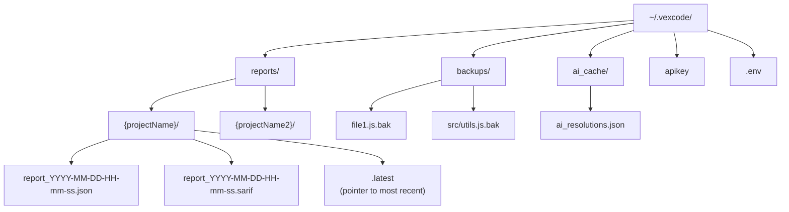

## 3.5. Thiết kế cơ sở dữ liệu

Hệ thống không sử dụng cơ sở dữ liệu quan hệ. Toàn bộ dữ liệu được lưu dưới dạng file JSON trong thư mục `~/.vexcode/reports/`. Mỗi project có một thư mục riêng, bên trong là các file JSON đánh dấu thời gian cho mỗi lần scan. Cách tiếp cận này giúp đơn giản hóa việc triển khai (không cần cài đặt DB server), dễ dàng backup và cho phép so sánh giữa các lần quét bằng cách so sánh trực tiếp các file JSON với nhau.

### 3.5.1. Finding: Đơn vị dữ liệu trung tâm

**Finding** là thực thể trung tâm của toàn bộ hệ thống. Mỗi finding biểu diễn một lỗi hoặc cảnh báo được phát hiện trong mã nguồn. Trong codebase, Finding được biểu diễn dưới dạng Python `dict` (không phải class) với các trường sau:

| Trường | Kiểu | Bắt buộc | Nguồn | Ý nghĩa |
|--------|------|----------|-------|---------|
| `file` | `str` | ✓ | Scanner | Đường dẫn tuyệt đối đến file chứa lỗi |
| `line` | `int` | ✓ | Scanner | Dòng bắt đầu phát hiện lỗi |
| `end_line` | `int` | ✗ | Scanner | Dòng kết thúc (nếu lỗi trải dài nhiều dòng) |
| `rule_id` | `str` | ✓ | Scanner | Mã rule của scanner (vd: `python.lang.security.audit.dangerous-exec`) |
| `message` | `str` | ✓ | Scanner | Mô tả lỗi bằng ngôn ngữ tự nhiên |
| `severity` | `str` | ✓ | Scanner → Enrich | `error` / `warning` / `info` (chuẩn hóa về chữ thường) |
| `code_text` | `str` | ✗ | Scanner | Dòng code bị báo lỗi (dùng để hiển thị trong web UI) |
| `cwe_id` | `str?` | ✗ | Scanner | Mã CWE (vd: `CWE-94`), trích xuất từ `extra.metadata.cwe` |
| `owasp_id` | `str?` | ✗ | Scanner | Mã OWASP (vd: `OWASP-A03`), trích xuất từ `extra.metadata.owasp` |
| `confidence` | `str?` | ✗ | Scanner | `HIGH` / `MEDIUM` / `LOW`: độ tin cậy của rule, từ `extra.metadata.confidence` |
| `precision` | `str?` | ✗ | Scanner | `HIGH` / `MEDIUM` / `LOW`: độ chính xác của rule, từ `extra.metadata.precision` |
| `iso_25010` | `str?` | ✗ | Scanner | Phân loại ISO 25010 cấp 1 từ rule metadata |
| `iso_subcategory` | `str?` | ✗ | Scanner | Phân loại ISO 25010 cấp 2 từ rule metadata |
| `category` | `str` | ✓ | Scanner → Enrich | `security` / `reliability` / `maintainability` / `performance` (ISO 25010) |
| `language` | `str?` | ✗ | Enrich | Ngôn ngữ lập trình suy từ phần mở rộng file |
| `id` | `str` | ✓ | Enrich | Định danh ổn định: SHA-1(`file\|line\|rule_id`), 12 ký tự hex |
| `fingerprint` | `str?` | ✗ | Scanner | Vân tay từ OpenGrep (dùng làm id nếu có) |
| `dataflow_trace` | `dict?` | ✗ | Scanner | Luồng dữ liệu taint: `{source, sink, propagators}` từ OpenGrep `--dataflow-traces` |
| `enclosing_function` | `str?` | ✗ | Scanner | Tên hàm bao quanh finding (từ `--output-enclosing-context`) |
| `enclosing_class` | `str?` | ✗ | Scanner | Tên lớp bao quanh finding (từ `--output-enclosing-context`) |
| `ast_context` | `dict?` | ✗ | Enricher | Ngữ cảnh AST từ GitNexus: `{symbol_name, kind, source_code, callers, blast_radius, impact}` |
| `finding_type` | `str?` | ✗ | AI Resolver | `confirmed` / `hotspot` / `false_positive`: kết quả phân loại AI |
| `status` | `str?` | ✗ | Web UI | `open` / `applied` / `false_positive` / `ignored`: trạng thái xử lý |
| `scan_status` | `str?` | ✗ | Scanner (re-scan) | `new` / `persisting` / `resolved` / `regressed`: so sánh liên scan |
| `_applied` | `bool?` | ✗ | CLI | (deprecated) Đánh dấu đã apply, giữ để tương thích ngược |

Các trường được đánh dấu "Bắt buộc" luôn có giá trị sau khi enrich. Các trường còn lại có thể `None` nếu scanner hoặc pipeline không cung cấp.

**Cơ chế định danh (`id`):** Định danh được tính bằng SHA-1 của tổ hợp `file:line:rule_id`, lấy 12 ký tự hex đầu tiên. Cơ chế này đảm bảo:
- Cùng một lỗi luôn có cùng id qua các lần quét (điều kiện tiên quyết cho scan_status).
- Khi developer sửa lỗi và dòng code thay đổi, id cũng thay đổi: đây là tính chất mong muốn vì lỗi cũ đã được xử lý.
- Khi re-scan, id cho phép phát hiện lỗi mới (NEW), lỗi đã sửa (RESOLVED) và lỗi tái phát (REGRESSED).

### 3.5.2. Report: Cấu trúc báo cáo

Mỗi lần scan tạo ra một file JSON với cấu trúc như sau:

| Trường | Kiểu | Ý nghĩa |
|--------|------|---------|
| `scanner` | `str` | Tên scanner (`opengrep` / `opengrep-mock` / `opengrep-mock-fallback`) |
| `timestamp` | `str` | Thời gian scan (ISO 8601) |
| `target_path` | `str` | Đường dẫn thư mục/dự án được quét |
| `findings` | `Finding[]` | Danh sách các finding phát hiện được |
| `ai_resolutions` | `dict<string, Resolution>` | Map `rule_id → Resolution`, kết quả từ AI pipeline |
| `git_state` | `dict` | Trạng thái git tại thời điểm scan: `{commit, is_dirty}` |
| `metrics` | `dict` | Độ phức tạp từng file: `{files: {path: {complexity, cognitive_complexity, level, loc}}}` |
| `fallback_reason` | `str?` | Lý do fallback (nếu scanner/AI không chạy được) |

### 3.5.3. AI Resolution: Đề xuất sửa lỗi

Mỗi resolution là kết quả từ AI 3-stage pipeline, được lưu trong `report.ai_resolutions` với key là `rule_id`:

| Trường | Kiểu | Ý nghĩa |
|--------|------|---------|
| `suggestion` | `str` | Giải thích cách sửa lỗi bằng ngôn ngữ tự nhiên |
| `remediation_code` | `str` | Mã nguồn thay thế cụ thể (nếu finding là `confirmed`) |
| `classification` | `str` | `confirmed` / `hotspot` / `false_positive`: phân loại của AI |
| `ai_status` | `str` | `success` / `failed` / `fallback_mock` |
| `ai_error` | `str?` | Thông báo lỗi nếu AI call thất bại |
| `model` | `str` | Tên model AI đã xử lý resolution này |
| `generated_at` | `str` | Thời gian tạo resolution (ISO 8601) |
| `remediation_target_file` | `str?` | File đích (nếu fix chỉ áp dụng cho một file) |
| `review_decision` | `str?` | Kết quả stage 3: `approved` / `rejected` |
| `review_comment` | `str?` | Nhận xét từ stage 3 (nếu có) |

### 3.5.4. Metrics: Độ phức tạp mã nguồn

Được tính bởi `radon` (Python) cho mỗi file trong target:

| Trường | Kiểu | Ý nghĩa |
|--------|------|---------|
| `loc` | `int` | Số dòng code (không tính comment và blank) |
| `complexity` | `float` | Cyclomatic complexity trung bình |
| `cognitive_complexity` | `float` | Cognitive complexity trung bình |
| `level` | `str` | `LOW` / `MEDIUM` / `HIGH`: xếp hạng tổng thể |

### 3.5.5. Lưu trữ và tổ chức file

Các file JSON được giữ lại vĩnh viễn để hỗ trợ so sánh giữa các lần quét (trend analytics): không có cơ chế xóa tự động. Mỗi file báo cáo là độc lập, không có quan hệ khóa ngoại, giúp đơn giản hóa việc sao lưu và di chuyển dữ liệu.

Cấu hình AI provider được lưu trong file `.env` tại `packages/engine/`, đọc bởi Python engine khi scan và ghi bởi Express server khi người dùng thay đổi cấu hình qua Web UI.

### 3.5.6. Mô hình miền

Hệ thống làm việc với bốn thực thể chính:

- **Project**: Thư mục dự án trên đĩa, đơn vị quét.
- **ScanSession**: Một lần thực thi pipeline, tạo ra một report JSON.
- **Finding**: Lỗi phát hiện được; đơn vị dữ liệu trung tâm.
- **Resolution**: Đề xuất sửa lỗi từ AI, có thể áp dụng cho nhiều finding cùng rule.

**Bảng 3.4. Tổng hợp pipeline**

| # | Giai đoạn | Công nghệ chính | Đầu ra |
|---|-----------|----------------|--------|
| 1 | Scan | OpenGrep, Gitleaks, OSV-Scanner | Findings thô |
| 2 | Dedup & Enrich | Core dedup, GitNexus KG | Findings + ngữ cảnh AST |
| 3 | Resolve | Complexity, Naming Audit, AI 3-stage | Findings + resolutions |
| 4 | Report & Quality Gate | Reporter, Thresholds | JSON + SARIF + verdict |
| 5 | View & Act | Express, React | Trạng thái finding |
