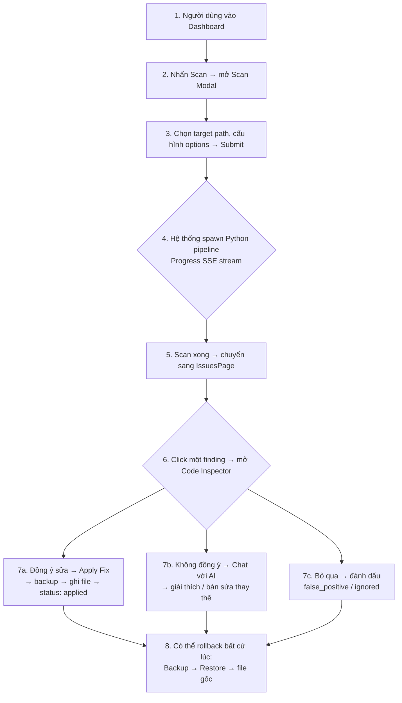

# 3.6. Thiết kế giao diện và tương tác người dùng

Giao diện của vexcode là Single Page Application (SPA) chạy hoàn toàn trên trình duyệt, không cần cài đặt thêm. Thiết kế hướng đến hai nhóm người dùng: developer muốn quét và sửa lỗi trực tiếp, và security engineer muốn theo dõi xu hướng lỗ hổng qua thời gian.

## 3.6.1. Nguyên tắc thiết kế giao diện

Hệ thống tuân theo ba nguyên tắc:

**Progressive disclosure.** Thông tin được hiển thị theo từng lớp. Dashboard chỉ hiểnIssues page hiển thị chi tiết hơn, và Code Inspector hiển thị đầy đủ nhất. Người dùng không bị ngập trong dữ liệu kỹ thuật ngay từ màn hình đầu.

**Real-time feedback.** Mọi thao tác tốn thời gian (scan, AI resolution) đều hiển thị tiến trình thực qua SSE. Người dùng thấy rõ đang ở giai đoạn nào: Scan, Enrich, Resolve, hay Report: kèm số lượng finding đã phát hiện.

**Safe by default.** Mọi thao tác ghi đè lên file nguồn (Apply Fix) đều được bảo vệ bởi tự động backup. Người dùng có thể rollback bất cứ lúc. Trạng thái finding (`open` / `applied` / `false_positive` / `ignored`) được lưu vĩnh viễn trong report JSON.

## 3.6.2. Các màn hình chính

### 3.6.2.1. Dashboard (OverviewPage)

Màn hình trang chủ sau khi đăng nhập. Hiển thị:

- **MetricsCards:** Số lượng findings theo severity (ERROR / WARNING / INFO), tổng số lỗi, số lỗi đã xử lý, điểm sức khỏe dự án (`HealthScoreChart`).
- **QualityTrendChart:** Biểu đồ xu hướng số lượng lỗi qua các lần quét gần nhất.
- **CategoryBreakdown:** Phân bổ lỗi theo danh mục ISO 25010 (security, reliability, maintainability, performance).
- **Leaderboards:** Top 5 file có nhiều lỗi nhất, top 5 loại lỗi phổ biến nhất.
- **CrossScanSummary:** So sánh nhanh giữa lần quét gần nhất và lần quét trước đó.

### 3.6.2.2. Issues (IssuesPage)

Danh sách tất cả findings của lần quét hiện tại, dạng bảng có khả năng:

- Lọc theo severity, category, status, confidence.
- Tìm kiếm toàn văn theo message, file path, rule_id.
- Sắp xếp theo file, dòng, severity, category.
- Phân trang (server-side) khi findings vượt quá giới hạn hiển thị.

Mỗi hàng hiển thị: severity badge, rule_id, message ngắn, file:line, AI classification badge, status badge.

### 3.6.2.3. Code Inspector (CodeInspector.tsx + 7 sub-components)

Màn hình chi tiết khi người dùng click vào một finding. Layout chia làm hai cột:

**Cột trái: File Viewer** (`FileViewer.tsx` + `CodeMirrorEditor.tsx`):
- Hiển thị toàn bộ file nguồn với syntax highlighting theo ngôn ngữ.
- Dòng chứa finding được highlight màu đỏ.
- Có thể click vào dòng khác để xem ngữ cảnh mở rộng.
- Thanh cuộn đồng bộ với danh sách findings (tùy chọn).

**Cột phải: Action Panel** gồm các component con:
- **CodeInspectorHeader:** Hiển thị rule_id, severity, category, CWE/OWASP, AI classification, status hiện tại.
- **DiffViewer:** Hiển thị diff giữa code gốc và `remediation_code` do AI đề xuất. Dùng `codemirror-merge` để hiển thị dạng inline diff.
- **ApplyFixButton:** Nút "Apply Fix". Khi nhấn:
  1. Hệ thống tạo backup file tại `~/.vexcode/backups/`.
  2. Ghi nội dung mới vào file đích.
  3. Cập nhật status finding → `applied`.
  4. Nếu có lỗi (content mismatch, out-of-bounds), báo lỗi rõ ràng cho người dùng.
- **ChatPanel:** Giao diện chat với AI về finding hiện tại. Người dùng có thể hỏi thêm, yêu cầu giải thích chi tiết, hoặc đòi bản sửa thay thế. Panel hiển thị lịch sử hội thoại, hỗ trợ streaming response.
- **AST Context Panel:** Nếu GitNexus có sẵn, hiển thị symbol info, callers, blast radius dạng cây/danh sách.

### 3.6.2.4. Graph (GraphPage)

Trang hiển thị đồ thị gọi hàm (call graph) của symbol đang xem. Sử dụng Sigma.js để render đồ thị tương tác:
- Mỗi node là một hàm/lớp.
- Mỗi cạnh là một lời gọi.
- Node đang xem được highlight màu khác.
- Click vào node khác để chuyển ngữ cảnh.

### 3.6.2.5. Security Hotspots (SecurityHotspotsPage)

Trang tập trung vào các findings có severity ERROR + confidence HIGH, sắp xếp theo mức độ nghiêm trọng. Mục đích giúp security engineer ưu tiên xử lý nhanh các lỗi nguy hiểm nhất.

### 3.6.2.6. Settings (SettingsDrawer)

Drawer mở từ header, chia thành các tab:

- **AI Provider:** Chọn provider (OpenAI, Anthropic, Google, 9router, NVIDIA), nhập API key, chọn model.
- **Model Selector:** Chọn model cho từng stage (classify, fix, review) nếu muốn tùy chỉnh.
- **API Config:** Cấu hình base URL, temperature, max tokens, timeout.
- **Advanced:** Toggle `AI_ENABLED`, cấu hình retry count, cooldown.
- **Quality Gate:** Tải file TOML thresholds, cấu hình ngưỡng passed/failed cho từng severity/category.
- **Semgrep:** Chọn đường dẫn custom rules, bật/tắt từng rule group.

Thay đổi cấu hình được ghi vào `.env` ngay lập tức, không cần restart server.

### 3.6.2.7. Scan Modal (ScanModal)

Modal xuất hiện khi người dùng nhấn nút Scan. Cho phép:
- Chọn thư mục dự án (với validation `isPathSafe`).
- Chọn scanner (OpenGrep, Gitleaks, OSV-Scanner): có thể bật/tắt từng loại.
- Chọn chế độ: full scan, fast scan (chỉ file đã thay đổi), mock scan.
- Bật/tắt AI resolution, chọn AI provider nếu đã cấu hình.
- Bật/tắt SARIF export.

## 3.6.3. Luồng tương tác chính

Luồng chính từ khi người dùng mở hệ thống đến khi áp dụng bản sửa:

## 3.6.4. Công nghệ giao diện

| Thành phần | Công nghệ | Lý do chọn |
|-----------|-----------|-----------|
| Framework | React 19 + TypeScript 5 | Component-based, type safety, ecosystem lớn |
| Build tool | Vite 6 | Hot reload nhanh, ESM native |
| Styling | Tailwind CSS v4 | Utility-first, responsive, không cần CSS file riêng |
| Code editor | CodeMirror 6 | Syntax highlighting đa ngôn ngữ, diff view, tree-sitter support |
| Diff view | `@codemirror/merge` | Inline diff với syntax highlighting |
| Graph | Sigma.js | Đồ thị tương tác, zoom/pan, custom styling |
| State | React Context + hooks | Đủ cho quy mô hiện tại, không cần Redux |
| HTTP client | Fetch API + custom hooks | Gói gọn, type-safe, xử lý SSE tự nhiên |
| Error handling | React ErrorBoundary | Bắt lỗi runtime, hiển thị fallback UI thay vì crash toàn trang |

## 3.6.5. Trải nghiệm theo vai trò

**Developer:** Mở Dashboard → Scan dự án → Xem Issues → Click lỗi → Đọc suggestion → Apply Fix → Xác nhận build vẫn qua. Toàn bộ quy trình mất dưới 5 phút cho một lỗi điển hình.

**Security Engineer:** Mở Dashboard → Xem QualityTrendChart → Phát hiện xu hướng tăng lỗi → Mở SecurityHotspotsPage → Ưu tiên ERROR + confidence HIGH → Dùng Code Inspector Chat để hỏi AI về tác động bảo mật → Ghi chú internal ticket.

**Tech Lead:** Mở CrossScanSummary → So sánh hai lần quét liên tiếp → Kiểm tra file nào bị regressed → Xem Graph để hiểu blast radius → Quyết định refactor scope.
