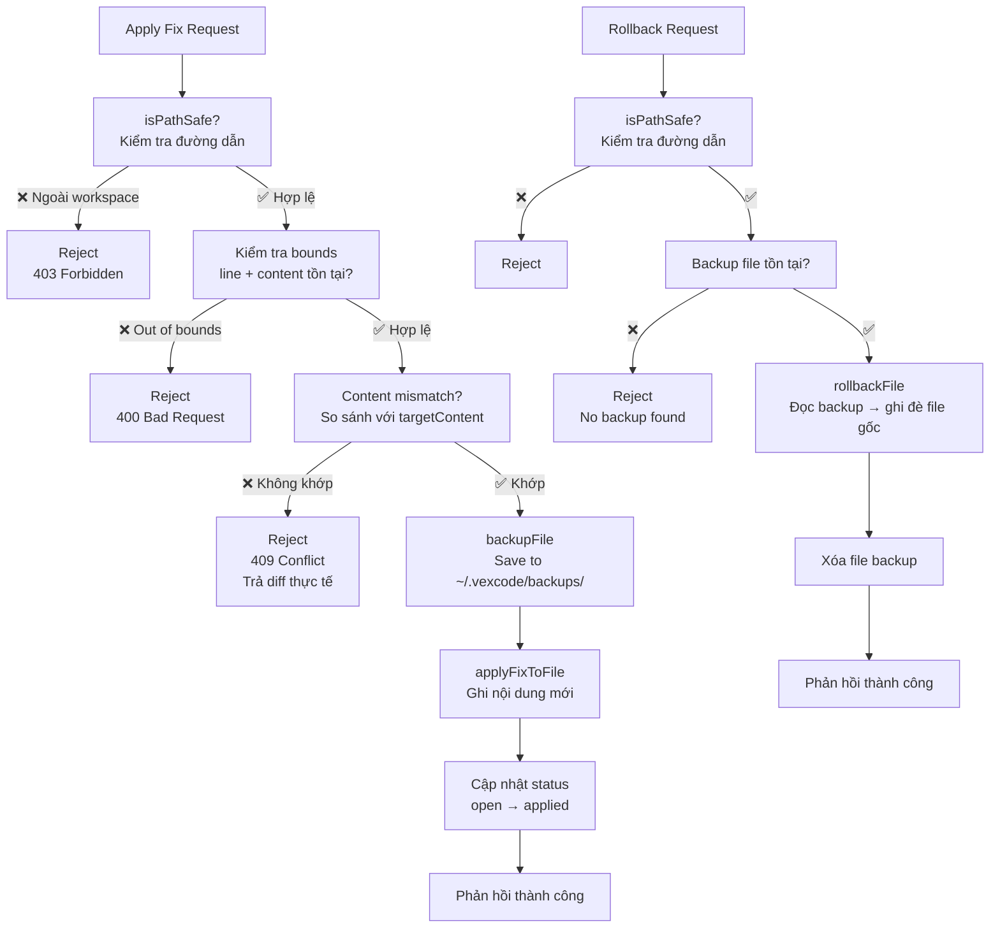

# 3.7. Bảo mật và độ tin cậy

Hệ thống chạy cục bộ trên máy của developer, nhưng vẫn phải xử lý các đầu vào không tin cậy (file nguồn, API responses, config do người dùng sửa) và đảm bảo không làm hỏng dữ liệu người dùng.

## 3.7.1. Boundary isolation bằng isPathSafe

Trước khi đọc, ghi, hoặc spawn process trên bất kỳ file nào, hệ thống kiểm tra đường dẫn qua `isPathSafe(targetPath, baseDir)` (`fileService.js:14`).

**Thuật toán:**
1. Gọi `path.resolve()` trên cả `targetPath` và `baseDir` để chuẩn hóa absolute path (loại bỏ `.`, `..`, symlink nếu có).
2. Gọi `path.relative(baseDir, resolved)`: nếu kết quả bắt đầu bằng `..` hoặc là absolute path (cross-drive trên Windows), có nghĩa `targetPath` nằm ngoài `baseDir`.
3. Trả về `true` chỉ khi relative path hợp lệ và không `..`.

**Điểm gọi trong codebase:**
- `routes/scan.js:80`: kiểm tra `finalTarget` trước khi spawn Python.
- `routes/files.js:68,95,151`: kiểm tra path trước khi đọc file gốc.
- `routes/reports.js:77`: kiểm tra path trước khi đọc report JSON.
- `routes/apply.js:21,63`: kiểm tra path trước khi apply fix hoặc rollback.

**Test coverage:** `fileService.test.js` có 8 test cases bao gồm path traversal đơn giản, path traversal với `../` nhiều cấp, prefix trick (`/workspace-evil`), và cross-drive trên Windows (`C:\` vs `D:\`).

## 3.7.2. Xác thực API: Bearer token + rate limiter

Tất cả REST API routes đều yêu cầu authentication trừ hai ngoại lệ:
- `/api/scan/stream`: SSE endpoint không gửi được header nên chấp nhận token qua query param `?token=`.
- `/api/auth/key`: expose public API key cho frontend handshake.

**API key generation** (`auth.js:16-31`): 32-byte random hex, lưu tại `~/.vexcode/apikey` với permission `0o600` (chỉ owner đọc/ghi). Nếu file chưa tồn tại, hệ thống tự tạo mới.

**Rate limiting** (`server.js:40-54`):
- Global: 100 requests / 15 phút cho tất cả `/api/*`.
- Scan: 10 requests / 15 phút cho các endpoint khởi động quét (`/api/scan`).

## 3.7.3. Bảo vệ đầu vào (input validation)

| Đầu vào | Ràng buộc | Vị trí |
|---------|-----------|--------|
| `target_path` | `isPathSafe` + `getProjectName` replace invalid chars | `scan.js`, `utils.js` |
| Request body | `express.json({ limit: '100kb' })` chống bomb payload | `server.js:37` |
| Rule config keys | Whitelist `knownKeys` trong `writeEnvConfig`: chỉ ghi các key đã biết | `fileService.js:70-88` |
| File content (apply) | Kiểm tra out-of-bounds line number + content mismatch trước khi ghi | `backupService.js:60-74` |

## 3.7.4. Safe apply và rollback

Trước khi ghi đề xuất sửa lỗi vào file nguồn, hệ thống bắt buộc thực hiện:

1. **Kiểm tra bounds:** `targetLine` và `targetLines.length` phải nằm trong phạm vi file. Nếu không → trả lỗi, không ghi.
2. **Kiểm tra content mismatch:** So sánh content tại target line với `targetContent` do AI trả về. Nếu không khớp → trả lỗi kèm diff thực tế và mong đợi.
3. **Line mapping fallback:** Nếu AI trả về line không chính xác, hệ thống dùng `codeText` để tìm dòng thực tế gần nhất.
4. **Tự động backup:** Trước khi ghi, copy toàn bộ nội dung file cũ vào `~/.vexcode/backups/{encodedPath}.bak`.
5. **Preserve line endings:** Giữ nguyên `\r\n` (Windows) hoặc `\n` (Unix) của file gốc.

**Rollback:** Người dùng gọi `/api/backup` với `action: 'restore'`. Hệ thống đọc backup file, ghi đè lên file gốc, xóa file backup sau khi thành công.

## 3.7.5. Quản lý process an toàn

**Process group kill** (`bridge.js`): Khi hủy scan, bridge gọi `child.kill('SIGTERM')` trên root Python process thay vì kill từng process con. Điều này đảm bảo các subprocess (ví dụ: OpenGrep binary, OSV-Scanner CLI) spawn bởi Python cũng bị terminate đúng cách.

**Timeouts:** Mỗi AI call có `AI_RESOLVE_TIMEOUT_SECONDS` (cấu hình qua `.env`). Nếu LLM không phản hồi trong thời gian cho phép, resolver ghi `ai_status: "failed"` và tiếp tục với finding đó: không block toàn bộ pipeline.

**Retry với exponential backoff:** Tối đa 3 lần với base delay 1 giây. Backoff giúp giảm áp lực lên provider khi có lỗi tạm thời.

## 3.7.6. Bảo vệ cấu hình AI (.env)

- **Không log secrets:** Khi đọc `.env`, các giá trị có chứa `KEY`, `TOKEN`, `SECRET`, `PASSWORD` được log dưới dạng `***` (nếu muốn mở rộng debug).
- **Preserve keys:** `writeEnvConfig` merge cấu hình mới với cấu hình cũ, đảm bảo không mất API key khi người dùng chỉ thay đổi model hoặc provider.
- **Init-only fallback:** Nếu AI_PROVIDER thiếu, hệ thống tự động rơi về mock resolution thay vì crash. Tương tự cho thiếu API key, base_url sai, hoặc model không tồn tại.
- **Permission hardening:** Tất cả file trong `~/.vexcode/` được tạo với permission hạn chế nhất có thể (`0o600` trên Unix-like, best-effort trên Windows).

## 3.7.7. Giảm thiểu rủi ro từ phụ thuộc bên ngoài

**Scanner fallback:**
- OpenGrep chưa cài → tự cài qua `opengrep_installer.py`. Nếu cài lỗi → dùng `opengrep-mock` findings.
- Gitleaks binary thiếu → chạy mock scanner.
- OSV-Scanner API lỗi → trả về findings rỗng, log warning.

**Knowledge Graph giảm mạnh:**
- GitNexus chưa chạy → bỏ qua giai đoạn Enrich hoàn toàn. Không có lỗi, chỉ thiếu `ast_context` trong output.

**AI Provider circuit (hiện tại):**
- Mock mode (`--mock-ai` hoặc thiếu config) → tất cả findings nhận classification `hotspot` + `remediation_code: "[mock] Run with real AI provider to generate fix."`
- Frontend hiển thị warning badge màu vàng khi `ai_status === 'fallback_mock'` (`CodeInspector.tsx:265`).
- Hooks `useChat.ts:31` chặn gửi message nếu resolution đang ở fallback_mock.

**React ErrorBoundary:** Bắt lỗi runtime trong toàn bộ component tree. Khi có lỗi không mong muốn, hiển thị fallback UI kèm nút reload, không làm crash toàn trang.

## 3.7.8. Checklist bảo mật

| Rủi ro | Biện pháp | Trạng thái |
|--------|----------|------------|
| Path traversal (`../../../etc/passwd`) | `isPathSafe()` với `path.relative()` | ✅ Implemented |
| Payload quá lớn | Body limit 100KB | ✅ Implemented |
| Brute force API | Rate limiter 100 req/15ph | ✅ Implemented |
| Unauthorized access | Bearer token API key 32B | ✅ Implemented |
| Process runaway | Kill process group | ✅ Implemented |
| File overwrite unsafe | Backup + bounds check + content match | ✅ Implemented |
| Secrets leak | .env permission 0o600 | ✅ Implemented |
| AI cost explosion | Smart skip, cache, MAX_RESOLVE_FINDINGS | ✅ Implemented |
| Scanner hang/crash | Timeout + mock fallback | ✅ Implemented |
| Frontend crash | ErrorBoundary component | ✅ Implemented |
| LLM provider spam | Exponential backoff retry (3 lần) | ✅ Implemented |
| Circuit breaker (provider down) | Chưa có: có thể mở rộng | 🔄 Có thể bổ sung |
